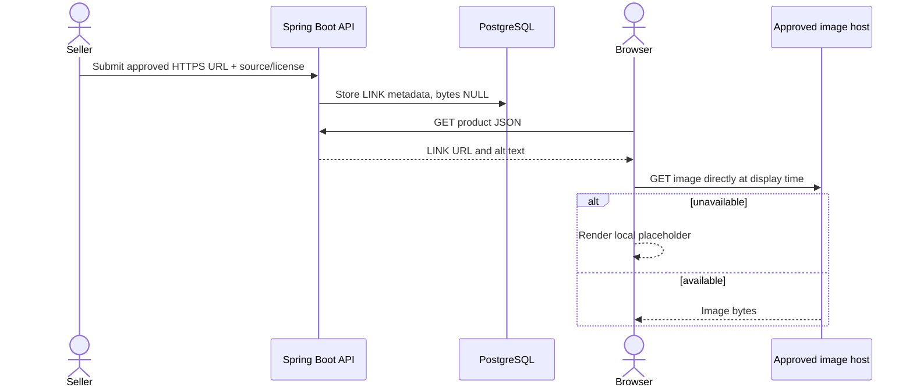
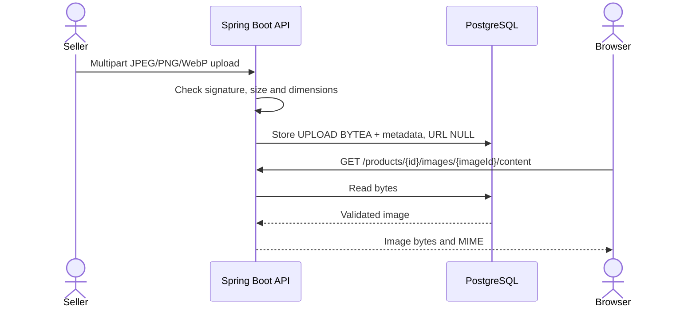

# Product Image Sequences

## LINK

```mermaid
sequenceDiagram
  actor Seller
  participant API as Spring Boot API
  participant DB as PostgreSQL
  actor Browser
  participant Host as Approved image host
  Seller->>API: Submit approved HTTPS URL + source/license
  API->>DB: Store LINK metadata, bytes NULL
  Browser->>API: GET product JSON
  API-->>Browser: LINK URL and alt text
  Browser->>Host: GET image directly at display time
  alt unavailable
    Browser-->>Browser: Render local placeholder
  else available
    Host-->>Browser: Image bytes
  end
```

## UPLOAD

```mermaid
sequenceDiagram
  actor Seller
  participant API as Spring Boot API
  participant DB as PostgreSQL
  actor Browser
  Seller->>API: Multipart JPEG/PNG/WebP upload
  API->>API: Check signature, size and dimensions
  API->>DB: Store UPLOAD BYTEA + metadata, URL NULL
  Browser->>API: GET /products/{id}/images/{imageId}/content
  API->>DB: Read bytes
  DB-->>API: Validated image
  API-->>Browser: Image bytes and MIME
```

Only future development product seed data uses LINK by convention; this documentation task creates no seed records.
