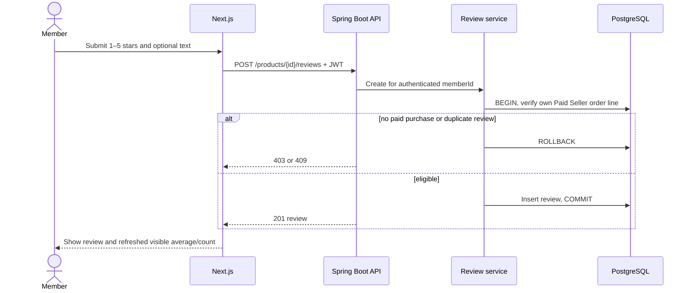

# Rating and Review Sequence

```mermaid
sequenceDiagram
  actor Member
  participant Web as Next.js
  participant API as Spring Boot API
  participant Review as Review service
  participant DB as PostgreSQL
  Member->>Web: Submit 1–5 stars and optional text
  Web->>API: POST /products/{id}/reviews + JWT
  API->>Review: Create for authenticated memberId
  Review->>DB: BEGIN, verify own Paid Seller order line
  alt no paid purchase or duplicate review
    Review->>DB: ROLLBACK
    API-->>Web: 403 or 409
  else eligible
    Review->>DB: Insert review, COMMIT
    API-->>Web: 201 review
  end
  Web-->>Member: Show review and refreshed visible average/count
```

Admin moderation changes visibility; public rating summary excludes hidden reviews.
