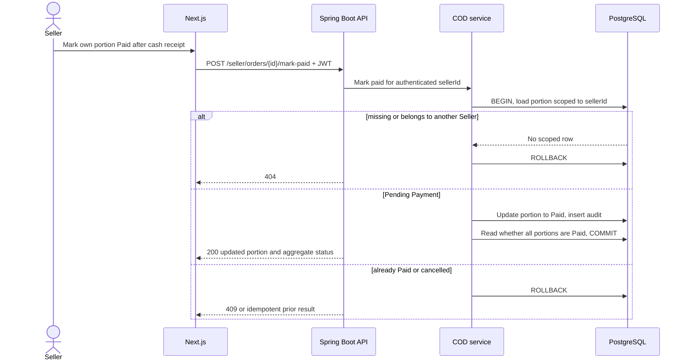

# Seller COD Payment Sequence

```mermaid
sequenceDiagram
  actor Seller
  participant Web as Next.js
  participant API as Spring Boot API
  participant Pay as COD service
  participant DB as PostgreSQL
  Seller->>Web: Mark own portion Paid after cash receipt
  Web->>API: POST /seller/orders/{id}/mark-paid + JWT
  API->>Pay: Mark paid for authenticated sellerId
  Pay->>DB: BEGIN, load portion scoped to sellerId
  alt missing or belongs to another Seller
    DB-->>Pay: No scoped row
    Pay->>DB: ROLLBACK
    API-->>Web: 404
  else Pending Payment
    Pay->>DB: Update portion to Paid, insert audit
    Pay->>DB: Read whether all portions are Paid, COMMIT
    API-->>Web: 200 updated portion and aggregate status
  else already Paid or cancelled
    Pay->>DB: ROLLBACK
    API-->>Web: 409 or idempotent prior result
  end
```

No gateway, bank transfer, shipping event or refund transition exists. The physical cash handoff is outside the application.
