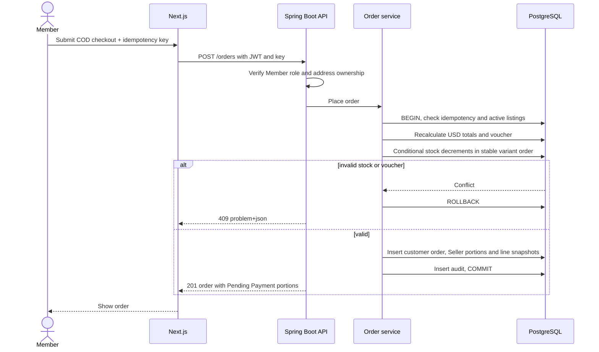

# COD Checkout Sequence

```mermaid
sequenceDiagram
  actor Member
  participant Web as Next.js
  participant API as Spring Boot API
  participant Order as Order service
  participant DB as PostgreSQL
  Member->>Web: Submit COD checkout + idempotency key
  Web->>API: POST /orders with JWT and key
  API->>API: Verify Member role and address ownership
  API->>Order: Place order
  Order->>DB: BEGIN, check idempotency and active listings
  Order->>DB: Recalculate USD totals and voucher
  Order->>DB: Conditional stock decrements in stable variant order
  alt invalid stock or voucher
    DB-->>Order: Conflict
    Order->>DB: ROLLBACK
    API-->>Web: 409 problem+json
  else valid
    Order->>DB: Insert customer order, Seller portions and line snapshots
    Order->>DB: Insert audit, COMMIT
    API-->>Web: 201 order with Pending Payment portions
  end
  Web-->>Member: Show order
```

A repeated key with the same fingerprint returns the committed order; a different payload returns 409. An unauthenticated Guest cannot enter the transaction.
